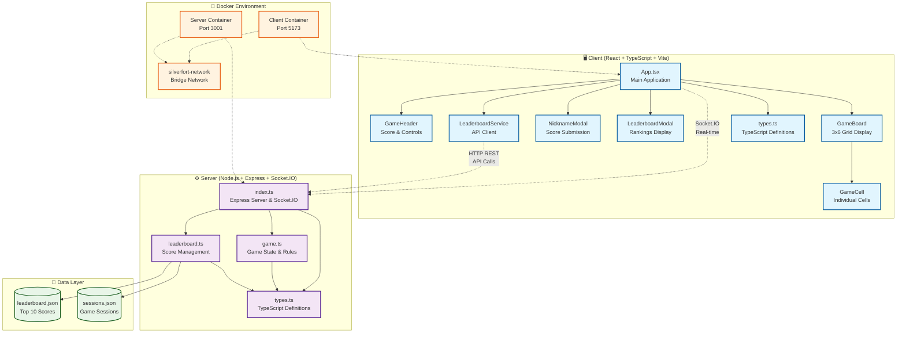
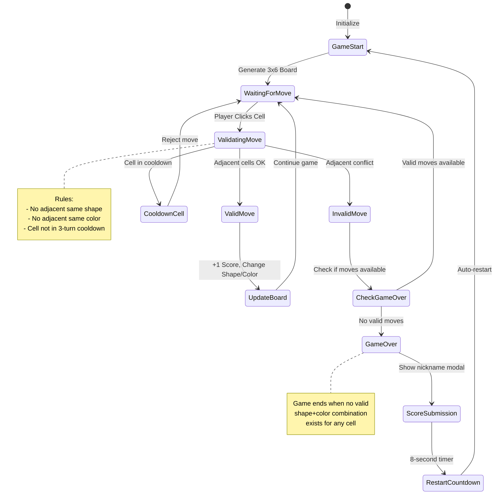

# Silverfort Game - Architecture Overview

This document provides an overview of the Silverfort Game architecture using Mermaid diagrams.

## System Architecture

```mermaid
graph TB
    %% Client Side
    subgraph CLIENT ["🖥️ Client (React + TypeScript + Vite)"]
        App[App.tsx<br/>Main Application]
        GameHeader[GameHeader<br/>Score & Controls]
        GameBoard[GameBoard<br/>3x6 Grid Display]
        GameCell[GameCell<br/>Individual Cells]
        NicknameModal[NicknameModal<br/>Score Submission]
        LeaderboardModal[LeaderboardModal<br/>Rankings Display]
        LeaderboardService[LeaderboardService<br/>API Client]
        ClientTypes[types.ts<br/>TypeScript Definitions]
    end

    %% Server Side
    subgraph SERVER ["⚙️ Server (Node.js + Express + Socket.IO)"]
        ServerIndex[index.ts<br/>Express Server & Socket.IO]
        GameLogic[game.ts<br/>Game State & Rules]
        LeaderboardLogic[leaderboard.ts<br/>Score Management]
        ServerTypes[types.ts<br/>TypeScript Definitions]
    end

    %% Data Storage
    subgraph DATA ["💾 Data Layer"]
        LeaderboardFile[(leaderboard.json<br/>Top 10 Scores)]
        SessionsFile[(sessions.json<br/>Game Sessions)]
    end

    %% Docker Infrastructure
    subgraph DOCKER ["🐳 Docker Environment"]
        ClientContainer[Client Container<br/>Port 5173]
        ServerContainer[Server Container<br/>Port 3001]
        DockerNetwork[silverfort-network<br/>Bridge Network]
    end

    %% Component Relationships
    App --> GameHeader
    App --> GameBoard
    App --> NicknameModal
    App --> LeaderboardModal
    App --> LeaderboardService
    GameBoard --> GameCell
    App --> ClientTypes

    %% Client-Server Communication
    App -.->|Socket.IO<br/>Real-time| ServerIndex
    LeaderboardService -.->|HTTP REST<br/>API Calls| ServerIndex

    %% Server Internal
    ServerIndex --> GameLogic
    ServerIndex --> LeaderboardLogic
    ServerIndex --> ServerTypes
    GameLogic --> ServerTypes
    LeaderboardLogic --> ServerTypes

    %% Data Persistence
    LeaderboardLogic --> LeaderboardFile
    LeaderboardLogic --> SessionsFile

    %% Docker Deployment
    ClientContainer -.-> App
    ServerContainer -.-> ServerIndex
    ClientContainer -.-> DockerNetwork
    ServerContainer -.-> DockerNetwork

    %% Styling
    classDef clientComp fill:#e1f5fe,stroke:#01579b,stroke-width:2px
    classDef serverComp fill:#f3e5f5,stroke:#4a148c,stroke-width:2px
    classDef dataComp fill:#e8f5e8,stroke:#1b5e20,stroke-width:2px
    classDef dockerComp fill:#fff3e0,stroke:#e65100,stroke-width:2px

    class App,GameHeader,GameBoard,GameCell,NicknameModal,LeaderboardModal,LeaderboardService,ClientTypes clientComp
    class ServerIndex,GameLogic,LeaderboardLogic,ServerTypes serverComp
    class LeaderboardFile,SessionsFile dataComp
    class ClientContainer,ServerContainer,DockerNetwork dockerComp
```

## Game Logic Flow

```mermaid
stateDiagram-v2
    [*] --> GameStart: Initialize
    
    GameStart --> WaitingForMove: Generate 3x6 Board
    
    WaitingForMove --> ValidatingMove: Player Clicks Cell
    
    ValidatingMove --> ValidMove: Adjacent cells OK
    ValidatingMove --> InvalidMove: Adjacent conflict
    ValidatingMove --> CooldownCell: Cell in cooldown
    
    ValidMove --> UpdateBoard: +1 Score, Change Shape/Color
    UpdateBoard --> WaitingForMove: Continue game
    
    InvalidMove --> CheckGameOver: Check if moves available
    CooldownCell --> WaitingForMove: Reject move
    
    CheckGameOver --> WaitingForMove: Valid moves available
    CheckGameOver --> GameOver: No valid moves
    
    GameOver --> ScoreSubmission: Show nickname modal
    ScoreSubmission --> RestartCountdown: 8-second timer
    RestartCountdown --> GameStart: Auto-restart
    
    note right of ValidatingMove
        Rules:
        - No adjacent same shape
        - No adjacent same color
        - Cell not in 3-turn cooldown
    end note
    
    note right of GameOver
        Game ends when no valid
        shape+color combination
        exists for any cell
    end note
```